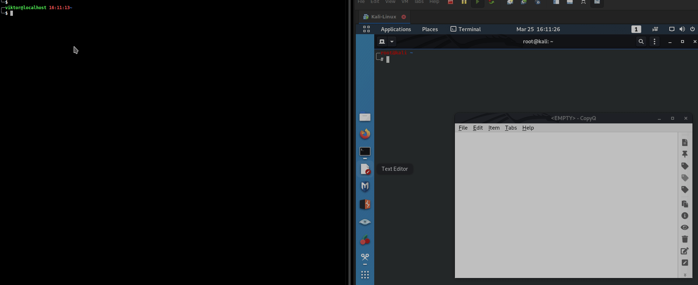
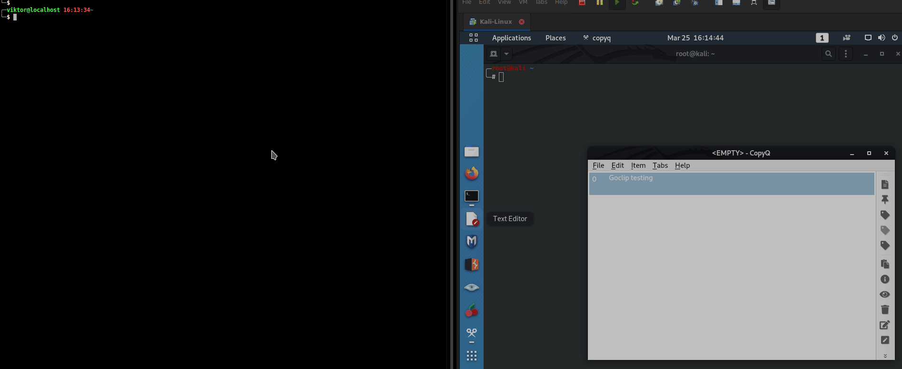

# goclip

## Description

Command-line application to share the contents of your clipboard with people on your local area network (LAN).

The application can work in both send and receive mode.

### Working modes

- `send`
  - Multicasts clipboard contents to `239.0.0.0:9999` on all interfaces by default (can specify which interface(s) to use. See [Usage](#usage))
  - If the size exceeds a single UDP datagram (8k), tell peers to initiate a TCP connection. TCP handler is started on `tcp/30099`
- `receive`
  - Listen for multicast messages and once one is received parse it's contents and type (text or image) and store it in the clipboard
  - If the size of the content is too big, initiate a TCP connection to the sender to receive the contents that way

# Requirements

This app uses [go bindings for GTK3](https://github.com/gotk3/gotk3/).
It's needed in order to store anything else but text in the clipboard.
The gtk package requires the cairo, glib, and gdk packages as dependencies.

Here is how to install these packages on some popular distros:

## Ubuntu/Debian

Ubuntu uses the GTK 3.10 release. Also, some required packages may be missing. You may need to install the first or all of these packages in Ubuntu before gotk3:

```bash
$ sudo apt install libgtk-3-dev libcairo2-dev libglib2.0-dev
```

## Fedora

```bash
$ sudo dnf install gtk3-devel cairo-devel glib-devel
```

## Alpine

```bash
$ sudo apk add gtk+3.0-dev cairo-dev glib-dev
```

## Arch

There's already source codes in binary packages. So, by installing gtk3 you are also getting dev-part of it.

## Anything else

If you are using anything else, see the installation instructions [here](https://github.com/gotk3/gotk3/wiki#installation-instructions).

# Installation

From source with Golang installed

```bash
GO111MODULE=on go get -u github.com/viktorbarzin/goclip
```

# Usage





```bash
╰─$ goclip -h
NAME:
   goclip - Multicast clipboard contents over the network

USAGE:
   goclip [global options] command [command options] [arguments...]

DESCRIPTION:
   Application to share your clipboard over a LAN. The content is multicasted to 239.0.0.0:9999. If the content exceeds the maximum UDP datagram size of 8192 bytes then peer-to-peer TCP connection is initialized and content is send over it instead.

COMMANDS:
   send     send clipboard contents
   receive  receive clipboard contents
   help, h  Shows a list of commands or help for one command

GLOBAL OPTIONS:
   --help, -h  show help (default: false)

```

To send clipboard:

```bash
╰─$ goclip send -h
NAME:
   goclip send - send clipboard contents

USAGE:
   goclip send [command options] [arguments...]

OPTIONS:
   -t value, --timeout value    Seconds for which the application will be performing the action (send, receive). After this exit. (default: 60)
   -i value, --interface value  Interface to multicast on. Can be specified multiple times. (default: "all")
   --help, -h                   show help (default: false)

```

To receive clipboard:

```bash
╰─$ goclip receive -h
NAME:
   goclip receive - receive clipboard contents

USAGE:
   goclip receive [command options] [arguments...]

OPTIONS:
   -t value, --timeout value  Seconds for which the application will be performing the action (send, receive). After this exit. (default: 60)
   --help, -h                 show help (default: false)
```

## Examples

### Just send your clipboard:

```bash
goclip send
```

The application enumerates all network interfaces and starts multicasting on each for a period of 60 seconds.

### Multicast on some interfaces

Multicast on 1 interface

```bash
goclip send -i eth0
```

You can specify multiple interfaces with

```bash
goclip send -i eth0 -i wlan0
```

### Change multicast duration

You can change the time for which your clipboard will be multicasted.

```bash
goclip send -t <seconds int>
```

### Receive shared clipboard

```bash
goclip receive
```

The application takes care for initiating a TCP connection if the content size is too big.

Currently can receive text and images.
GIF support would be good to have but currently not implemented.

### Receive for some period

Similarly to the `send -t` you can use `receive -t` to change the time the app will wait for contents.
The receive command exists either upon receiving clipboard content or after the timeout is reached (default 60)

```bash
goclip receive -t <seconds int>
```

# Known issues

- GIFs send only 1 image instead of the whole animation

# Possible extensions

- Utilize MDNS/Zeroconf to discover peers
- Use only peer-to-peer TCP instead of multicast
- Encrypt clipboard contents
